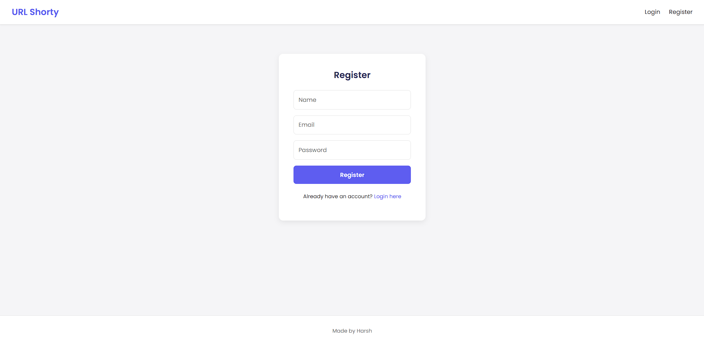
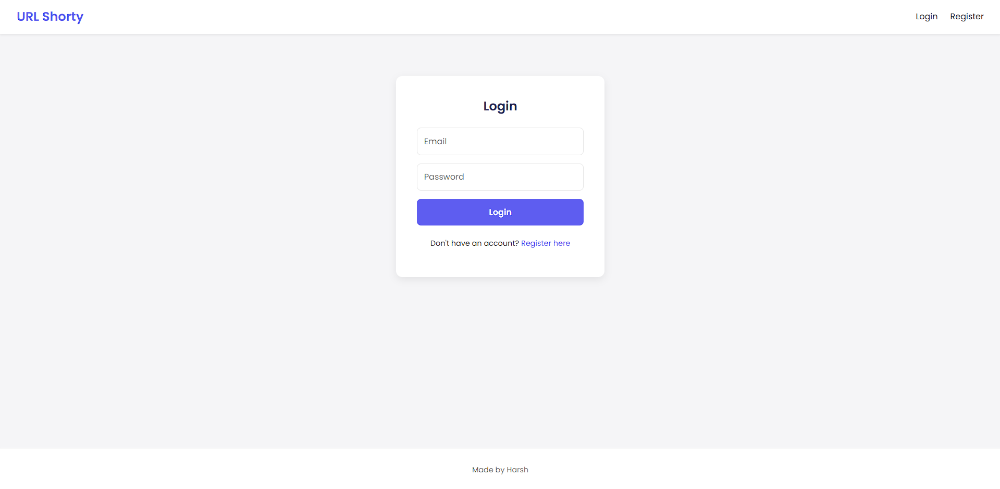
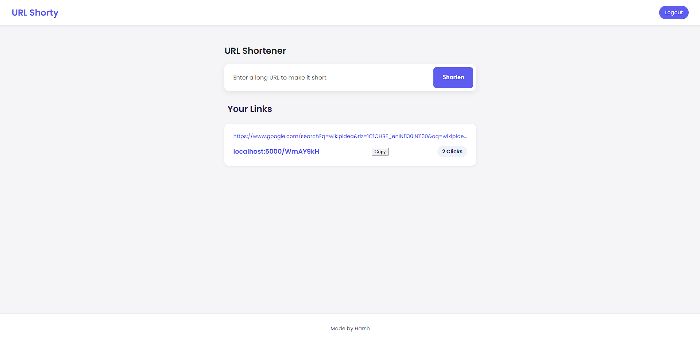

# 🌐 URL-Shorty

A modern **URL Shortener Web App** built with the **MERN stack (MongoDB, Express, React, Node.js)**.  
It allows users to shorten long URLs, manage them via a personal dashboard, and track click statistics — all with a clean UI.  

---

## 🚀 Features

- 🔑 **User Authentication** (Signup / Login with JWT)  
- ✂️ **Shorten URLs** instantly  
- 📊 **Click Tracking** for each short URL  
- 🗂 **Personal Dashboard** to manage all links  
- 🔒 **Secure Passwords** with hashing  

---

## 🛠 Tech Stack

**Frontend**: React, React Router, Axios, CSS / Tailwind (if used)  
**Backend**: Node.js, Express.js  
**Database**: MongoDB
**Authentication**: JWT, bcrypt  
**Other**: dotenv, cors  

---


## ⚙️ Installation & Setup

Follow these steps to run locally:

### 1️⃣ Clone the Repository
```bash
git clone https://github.com/YADAVHARSH913/URL-Shorty.git
cd URL-Shorty
2️⃣ Install Dependencies


Backend:
bash
cd backend
npm install


Frontend:
bash
cd ../frontend
npm install


3️⃣ Configure Environment Variables
Create a .env file inside backend/ with the following:

PORT=5000
MONGO_URI=your_mongodb_connection_string
JWT_SECRET=your_secret_key
CLIENT_URL=http://localhost:3000


4️⃣ Run the Application

Start backend:
bash
cd backend
nodemon

Start frontend:
bash
cd ../frontend
npm start
Frontend runs on http://localhost:3000
Backend runs on http://localhost:5000

🎯 Usage
Open http://localhost:3000 in browser

Signup / Login

Paste a long URL and shorten it ✂️

Share the short link and track clicks in your dashboard

```
## 📸 Screenshots

1. **Register Page**



2. **Login Page**



3. **URL Shortener**




📜 License
This project is licensed under the MIT License.
Feel free to use and modify it as per your needs.

👤 Author
Harsh Yadav
